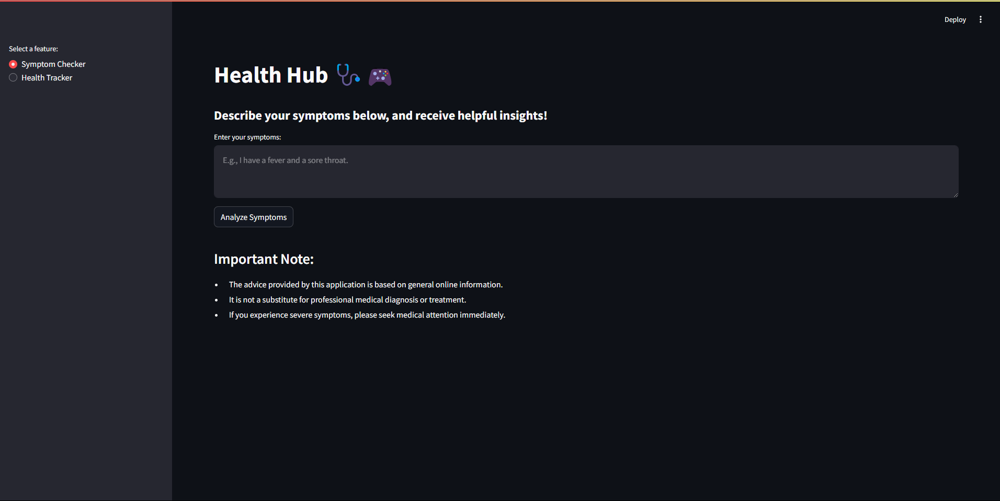

To run the project, first Install the Requirements.txt file
You can run - pip install -r requirements.txt 
Create your .env file and add in your Google API Key

After installation run - streamlit run app.py

